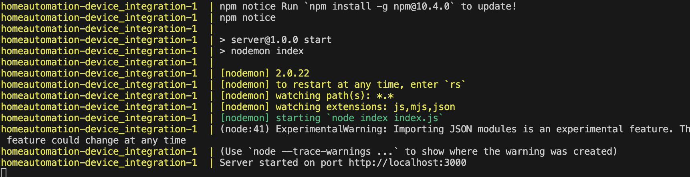

## Docker Compose Changes: 

If you made any recent changes to the docker-compose.yml file (like changing the port mappings), ensure you have applied those changes by bringing down and then up the services with:

```sh

docker-compose down
docker-compose up --build
```
Seeing the screenshot as below:

Now try to access the device-intergation and frontend port
```sh
#access the device integration
curl http://localhost:3000
#{"message":"Hello World!"}

curl http://localhost:3000/philips
#{"code":1,"msg":"Hello from Philips"}

curl http://localhost:3000/lifx
#{"code":1,"msg":"Hello from LIFX"

#access the frontend
curl http://localhost:8080
```


